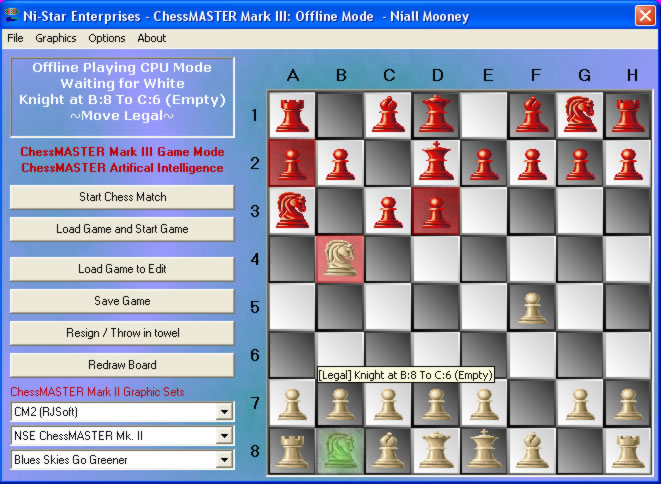



## PChessMASTER Mark III

### Description

ChessMASTER Mark III is a chess program. You can play with a friend over the internet (Client/Server Modes, with chat and scribble boxes) or locally or you can play against the inbuilt computer AI opponants. You can even allow the AI to play itself, perhaps taking bets on the outcome!

Virtually all graphical options had to be removed to upload to PSC, unfortunately.

There is a complete rule set built into the game and I have tried to represent most of them, although some ommissions do remain. Thanks for viewing, downloading, rating this and using program!
 
### More Info
 

             |
---                |---
**Submitted On**   |2003-01-06 15:00:32
**By**             |[Niall Mooney](https://github.com/Planet-Source-Code/PSCIndex/blob/master/ByAuthor/niall-mooney.md)
**Level**          |Advanced
**User Rating**    |4.8 (24 globes from 5 users)
**Compatibility**  |VB 6\.0
**Category**       |[Games](https://github.com/Planet-Source-Code/PSCIndex/blob/master/ByCategory/games__1-38.md)
**World**          |[Visual Basic](https://github.com/Planet-Source-Code/PSCIndex/blob/master/ByWorld/visual-basic.md)
**Archive File**   |[PChessMAST152603182003\.zip](https://github.com/Planet-Source-Code/niall-mooney-pchessmaster-mark-iii__1-42200/archive/master.zip)

